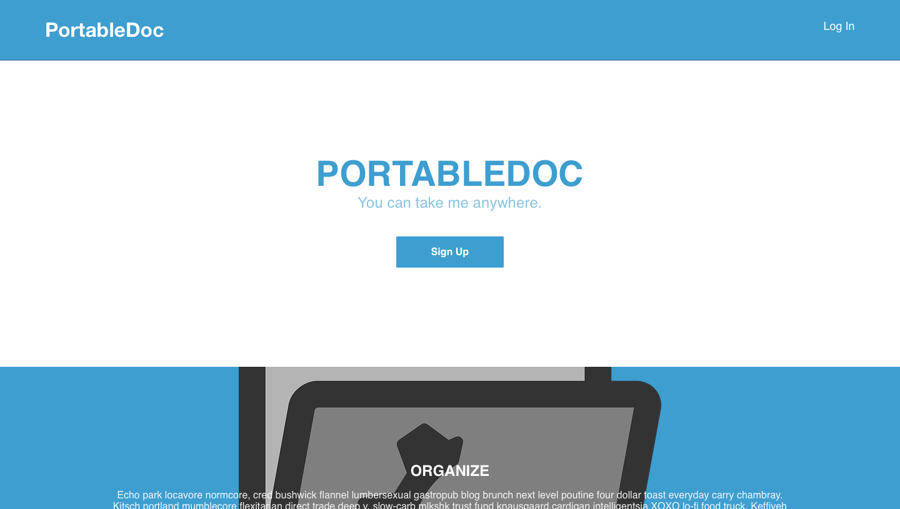

    <h1 class="container-title">Projects</h1>
    <ul id="hosted-projects">
        <li>
            
            

                
RoR app(Desktop View): Create Online Docs and acces them anywhere.

            

        </li>
        <li>
            
            

                
RoR app(Desktop View): Write posts everyone can read and comment on, while still keeping control of your content.

            

        </li>
        <li>
            
            

                
RoR app: Upload your images and share them with other users. 

            

        </li>
        <li>
            
            

                
RoR app(Desktop View): You can store digital or scanned files of traditional comic book art.

            

        </li>
        <li>
            
            

                
RoR app: Manage your daily tasks simply add them on taskly once they are done check'em off and trash

            

        </li>
        <!-- <li>
            
            

                

            

        </li>
        <li>
            
            

                

            

        </li>
        <li>
            
            

                

            

        </li> -->
    </ul>

    <h1 class="container-title">Codepens</h1>
    <ul id="codepen-embeds">
        <li>
            <!-- pongGame -->
            
See the Pen <a href="http://codepen.io/cjbeowulf/pen/VjjzaO/">PongGame</a> by Charlie Jaime (<a href="http://codepen.io/cjbeowulf">@cjbeowulf</a>) on <a href="http://codepen.io">CodePen</a>.

            
            

                
Recreate the traditional 1972 using HTML5 canvas tag

            

        </li>
        <li>
            <!-- mysteryGame -->
            
See the Pen <a href="http://codepen.io/cjbeowulf/pen/ECkve/">Child Mystery Game</a> by Charlie Jaime (<a href="http://codepen.io/cjbeowulf">@cjbeowulf</a>) on <a href="http://codepen.io">CodePen</a>.

            
            

                
simpliy clickable hide n seek game mainly created using jQuery

            
   
        </li>
        <li>
            <!-- musicBoxes -->
            
See the Pen <a href="http://codepen.io/cjbeowulf/pen/bprpGr/">Music Boxes </a> by Charlie Jaime (<a href="http://codepen.io/cjbeowulf">@cjbeowulf</a>) on <a href="http://codepen.io">CodePen</a>.

            
            

                
Musical boxes just give them a hover. Click and hold box for extra animtion

            

        </li>
        <li>
            <!-- cssAnimations -->
            
See the Pen <a href="http://codepen.io/cjbeowulf/pen/dxFGt/">Transitions/Transforms/Animation</a> by Charlie Jaime (<a href="http://codepen.io/cjbeowulf">@cjbeowulf</a>) on <a href="http://codepen.io">CodePen</a>.

            
            

                
A tri series of different effects you can create with CSS3 Transitions/Transforms/Animations

            

        </li>
        <li>
            
See the Pen <a href="http://codepen.io/cjbeowulf/pen/BzPyrv/">Brick Breaker Game</a> by Charlie Jaime (<a href="http://codepen.io/cjbeowulf">@cjbeowulf</a>) on <a href="http://codepen.io">CodePen</a>.

            

                
Re-built classic Brick Breaker Game

            

        </li>
        <li>
            
See the Pen <a href="http://codepen.io/cjbeowulf/pen/gPOrdv/">Digital Clock</a> by Charlie Jaime (<a href="http://codepen.io/cjbeowulf">@cjbeowulf</a>) on <a href="http://codepen.io">CodePen</a>.

            
            

                
Digital clock displaying time and date

            

        </li>
    </ul>

