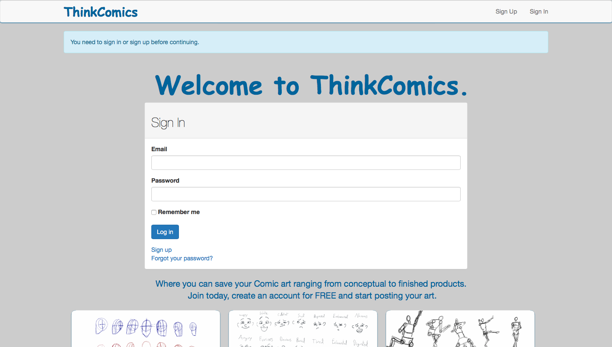

    <h1 class="container-title">Projects</h1>
    <ul id="hosted-projects">
        <li>
            
        </li>
        <li>
            
        </li>
        <li>
            
        </li>
        <li>
            
        </li>
        <li>
            
        </li>
        <li>
            
        </li>
        <li>
            
        </li>
        <li>
            
        </li>
    </ul>

    <h1 class="container-title">Codepens</h1>
    <ul id="codepen-embeds">
        <li>
            <!-- pongGame -->
            
See the Pen <a href="http://codepen.io/cjbeowulf/pen/VjjzaO/">PongGame</a> by Charlie Jaime (<a href="http://codepen.io/cjbeowulf">@cjbeowulf</a>) on <a href="http://codepen.io">CodePen</a>.

            
        </li>
        <li>
            <!-- mysteryGame -->
            
See the Pen <a href="http://codepen.io/cjbeowulf/pen/ECkve/">Child Mystery Game</a> by Charlie Jaime (<a href="http://codepen.io/cjbeowulf">@cjbeowulf</a>) on <a href="http://codepen.io">CodePen</a>.

               
        </li>
        <li>
            <!-- musicBoxes -->
            
See the Pen <a href="http://codepen.io/cjbeowulf/pen/bprpGr/">Music Boxes </a> by Charlie Jaime (<a href="http://codepen.io/cjbeowulf">@cjbeowulf</a>) on <a href="http://codepen.io">CodePen</a>.

        </li>
        <li>
            <!-- cssAnimations -->
            
See the Pen <a href="http://codepen.io/cjbeowulf/pen/dxFGt/">Transitions/Transforms/Animation</a> by Charlie Jaime (<a href="http://codepen.io/cjbeowulf">@cjbeowulf</a>) on <a href="http://codepen.io">CodePen</a>.

        </li>
        <li>
            
See the Pen <a href="http://codepen.io/cjbeowulf/pen/MeyXKd/">HTML5Player</a> by Charlie Jaime (<a href="http://codepen.io/cjbeowulf">@cjbeowulf</a>) on <a href="http://codepen.io">CodePen</a>.

        </li>
        <li>
            
See the Pen <a href="http://codepen.io/cjbeowulf/pen/gPOrdv/">Digital Clock</a> by Charlie Jaime (<a href="http://codepen.io/cjbeowulf">@cjbeowulf</a>) on <a href="http://codepen.io">CodePen</a>.

        </li>
    </ul>

